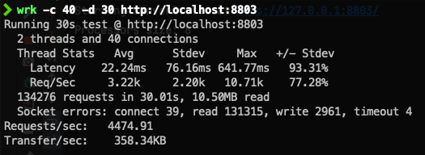

# 第二週作業

## 作業內容

### 作業1
> （选做）使用 GCLogAnalysis.java 自己演练一遍串行 / 并行 /CMS/G1 的案例。

- [Serial GC Log](./nio01/gc_log/serial_gc.log)
- [Parallel GC Log](./nio01/gc_log/parallel_gc.log)
- [CMS GC Log](./nio01/gc_log/cms_gc.log)
- [G1 GC Log](./nio01/gc_log/g1_gc.log)

### 作業2
> （选做）使用压测工具（wrk 或 sb），演练 gateway-server-0.0.1-SNAPSHOT.jar 示例。

- 未完成

### 作業3
> （选做）如果自己本地有可以运行的项目，可以按照 2 的方式进行演练。

- 未完成

### 作業4
> （必做）根据上述自己对于 1 和 2 的演示，写一段对于不同 GC 和堆内存的总结，提交到 GitHub。

- [總結](./nio01/gc_log/README.md)

### 作業5
> （选做）运行课上的例子，以及 Netty 的例子，分析相关现象。

- [HttpServer01](./nio01/src/main/java/java0/nio01/server/HttpServer01.java) 壓測

- [HttpServer02](./nio01/src/main/java/java0/nio01/server/HttpServer02.java) 壓測 (系統一直重開機所以調低壓測參數)

- [HttpServer03](./nio01/src/main/java/java0/nio01/server/HttpServer03.java) 壓測

- [NettyHttpServer](./nio01/src/main/java/java0/nio01/server/netty/NettyHttpServer.java) 壓測

### 作業6
> （必做）写一段代码，使用 HttpClient 或 OkHttp 访问  http://localhost:8801 ，代码提交到 GitHub

- [HttpClient Demo](./nio01/src/main/java/java0/nio01/client/HttpClient1.java)
- [OkHttp Demo](./nio01/src/main/java/java0/nio01/client/OkHttpClient1.java)

