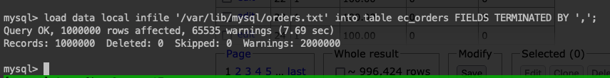
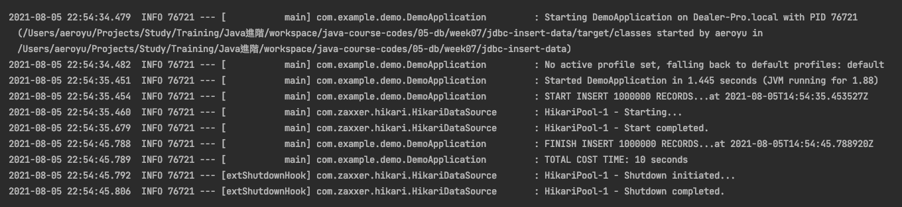

# 第七週作業

## 作業內容

### 作業1
>（选做）用今天课上学习的知识，分析自己系统的 SQL 和表结构

- 未完成

### 作業2
>（必做）按自己设计的表结构，插入 100 万订单模拟数据，测试不同方式的插入效率

- Loading Data into a Table

- JDBC Batch

### 作業3
>（选做）按自己设计的表结构，插入 1000 万订单模拟数据，测试不同方式的插入效

- 未完成

### 作業4
>（选做）使用不同的索引或组合，测试不同方式查询效率

- 未完成

### 作業5
>（选做）调整测试数据，使得数据尽量均匀，模拟 1 年时间内的交易，计算一年的销售报表：销售总额，订单数，客单价，每月销售量，前十的商品等等（可以自己设计更多指标）

- 未完成

### 作業6
>（选做）尝试自己做一个 ID 生成器（可以模拟 Seq 或 Snowflake）

- [自定義 SeqNo ID 產生器](./jdbc-insert-data/src/main/java/com/example/demo/util/SeqIdUtils.java)

### 作業7
>（选做）尝试实现或改造一个非精确分页的程序

- 未完成

### 作業8
>（选做）配置一遍异步复制，半同步复制、组复制

- [README](./mysql-replication/mysql_replication.md)

### 作業9
>（必做）读写分离 - 动态切换数据源版本 1.0

- [README](./dynamic-datasource/README.md)

### 作業10
>（必做）读写分离 - 数据库框架版本 2.0

- [README](./shardingsphere-jdbc/README.md)

### 作業11
>（选做）读写分离 - 数据库中间件版本 3.0

- 未完成

### 作業12
>（选做）配置 MHA，模拟 master 宕机

- 未完成

### 作業13
>（选做）配置 MGR，模拟 master 宕机

- 未完成

### 作業14
>（选做）配置 Orchestrator，模拟 master 宕机，演练 UI 调整拓扑结构

- 未完成

