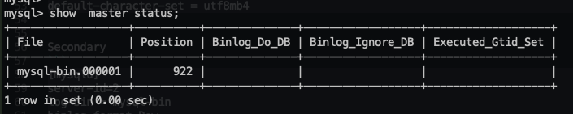

## MySQL Replication 機制

用 Docker 啟動兩個 MySQL 節點

```yaml
mysql:
  image: mysql:5.7
  container_name: mysql
  restart: always
  ports:
    - "3306:3306"
  volumes:
    - ./data:/var/lib/mysql
    - ./conf.d:/etc/mysql/conf.d
  environment:
    MYSQL_ROOT_PASSWORD: 12345678
```

```yaml
mysql2:
  image: mysql:5.7
  container_name: mysql2
  restart: always
  ports:
    - "3307:3306"
  volumes:
    - ./data:/var/lib/mysql
    - ./conf.d:/etc/mysql/conf.d
  environment:
    MYSQL_ROOT_PASSWORD: 12345678
```

其中分別建立兩個 my.cnf 在本機執行 `docker compose` 的當前路徑的 `./conf.d` 目錄下

Primary
```
[mysqld]
server-id=1
log-bin = mysql-bin
binlog-format=Row

long_query_time = 0.1 # seconds
slow_query_log_file = /var/log/mysql/slow.log
log_queries_not_using_indexes = 1
log_throttle_queries_not_using_indexes = 100

character-set-server=utf8mb4

[client]
default-character-set = utf8mb4

[mysql]
default-character-set = utf8mb4
```

Secondary
```
[mysqld]
server-id=2
log-bin = mysql-bin
binlog-format=Row

long_query_time = 0.1 # seconds
slow_query_log_file = /var/log/mysql/slow.log
log_queries_not_using_indexes = 1
log_throttle_queries_not_using_indexes = 100

character-set-server=utf8mb4

[client]
default-character-set = utf8mb4

[mysql]
default-character-set = utf8mb4
```

個別啟動 `docker-compose up -d`

查看 Primary 節點 master status



設定 Secondary 追蹤 master 節點
```mysql
CHANGE MASTER TO
MASTER_HOST='192.168.65.2',
MASTER_PORT=3306,
MASTER_USER='root',
MASTER_PASSWORD='12345678',
MASTER_LOG_FILE='mysql-bin.000001',
MASTER_LOG_POS=922;
```

啟動 Secondary Slave Running
```mysql
mysql> show slave status\G
*************************** 1. row ***************************
               Slave_IO_State: Waiting for master to send event
                  Master_Host: 192.168.65.2
                  Master_User: root
                  Master_Port: 3306
                Connect_Retry: 60
              Master_Log_File: mysql-bin.000001
          Read_Master_Log_Pos: 1226
               Relay_Log_File: 907ade49d204-relay-bin.000002
                Relay_Log_Pos: 624
        Relay_Master_Log_File: mysql-bin.000001
             Slave_IO_Running: Yes
            Slave_SQL_Running: Yes
              Replicate_Do_DB:
          Replicate_Ignore_DB:
           Replicate_Do_Table:
.........................

```
