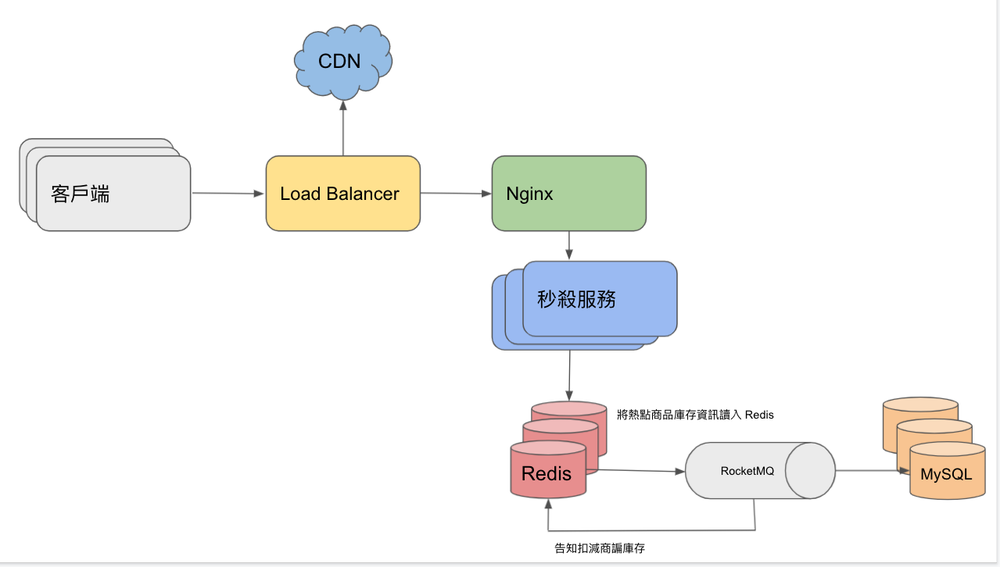

# 秒殺系統架構設計

## 架構圖

## 架構設計思維

- 將可承受併發流量最高的 Load Balancer(例如：F5)，承接客戶端的流量。
- 將靜態資源提前放置到 CDN，以達到動靜分離效果。
- 在 Load Balancer 後方，放置 Nginx 降低瞬間流量並分流。
- 經過 Load Balancer 與 Nginx 的分流後，此時的流量已被分散到秒殺服務(Tomcat)做處理。
- 透過 Redis 查詢請求商品是否有庫存，若判斷沒有庫存則回覆該商品已售完，有庫存則發送建立新訂單訊息給 RocketMQ。
- RocketMQ 接收訊息後一個個將實際的建立新訂單訊息與實際庫存量存入 MySQL，並通知 Redis 要修改剩餘庫存。
- 有了前面的分流與 MQ 的削峰填谷後，瞬間的高流量不會到 DB 這塊，讓整個系統能順利運作。

## 秒殺服務端

- 動態生成 URL，讓 URL 有時效性，以避免攻擊者惡意下單。
- 限流處理，避免流量來不及處理而拖垮整個服務。

## Redis 端
- 集群間的商品庫存同步問題
- 可使用 Lua 腳本實現類似 Transaction 功能，以避免庫存超賣。

## MySQL 端
- 集群間的資料同步問題

